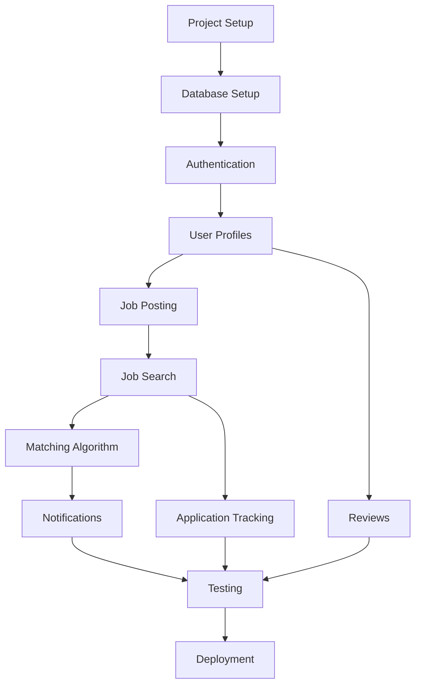

# Task Breakdown: ContractsOnly Implementation

## Phase 1: Project Setup & Foundation (Week 1)

### 1.1 Project Initialization [AUTONOMOUS]
- [ ] Initialize Next.js 15 project with TypeScript
  ```bash
  npx create-next-app@latest contracts-only --typescript --tailwind --app --src-dir
  cd contracts-only
  ```
- [ ] Configure ESLint and Prettier
  ```bash
  npm install -D @typescript-eslint/parser @typescript-eslint/eslint-plugin prettier eslint-config-prettier
  ```
- [ ] Set up Git repository and initial commit
- [ ] Create folder structure
  ```
  src/
    app/
    components/
    lib/
    hooks/
    types/
    utils/
  ```

### 1.2 Database Setup [AUTONOMOUS]
- [ ] Install and configure Supabase
  ```bash
  npm install @supabase/supabase-js
  ```
- [ ] Define database schema in Supabase Dashboard
- [ ] Set up PostgreSQL database (Supabase)
- [ ] Configure Row Level Security policies
- [ ] Seed database with sample data

### 1.3 Authentication System [AUTONOMOUS]
- [ ] Install and configure NextAuth.js
  ```bash
  npm install next-auth
  ```
- [ ] Set up authentication providers (Email, Google, LinkedIn)
- [ ] Create auth API routes
- [ ] Implement session management
- [ ] Build login/register pages
- [ ] Add protected route middleware

### 1.4 UI Foundation [AUTONOMOUS]
- [ ] Set up Tailwind CSS configuration
- [ ] Create base layout components
- [ ] Implement responsive navigation
- [ ] Design component library (Button, Input, Card, etc.)
- [ ] Set up dark mode support (optional)
- [ ] Create loading and error states

## Phase 2: Core User Features (Week 2)

### 2.1 User Profile Management [AUTONOMOUS]
- [ ] Create profile models and API routes
- [ ] Build contractor profile page
  - Skills selection
  - Hourly rate inputs
  - Availability settings
  - Bio and portfolio sections
- [ ] Build company profile page
  - Company information
  - Verification badge logic
- [ ] Implement profile edit functionality
- [ ] Add image upload for avatars/logos

### 2.2 Job Posting System [AUTONOMOUS]
- [ ] Create job posting form
  - Multi-step form wizard
  - Rich text editor for descriptions
  - Skills tagging system
  - Rate and duration inputs
- [ ] Build job preview page
- [ ] Implement job edit/delete
- [ ] Add job expiration logic (30 days)
- [ ] Create employer dashboard

### 2.3 Job Listing & Search [AUTONOMOUS]
- [ ] Build job listing page with cards
- [ ] Implement search functionality
  - Keyword search
  - PostgreSQL full-text search setup
- [ ] Create filter sidebar
  - Rate range slider
  - Duration checkboxes
  - Contract type selection
  - Location/remote filters
- [ ] Add pagination
- [ ] Implement sorting options

## Phase 3: Advanced Features (Week 3)

### 3.1 Job Matching Algorithm [MIXED]
- [ ] Design matching algorithm logic
- [ ] Create matching score calculation
  ```typescript
  calculateMatchScore(job: Job, contractor: Contractor): number
  ```
- [ ] Build database queries for matching
- [ ] Create background job for matching
- [ ] Test and refine algorithm [USER INTERVENTION]

### 3.2 Notification System [AUTONOMOUS]
- [ ] Set up email service (SendGrid/AWS SES)
- [ ] Create email templates
  - Job match notification
  - Job expiration reminder
  - Welcome email
  - Password reset
- [ ] Build notification preferences page
- [ ] Implement email queue system
- [ ] Add unsubscribe functionality

### 3.3 Rating & Review System [AUTONOMOUS]
- [ ] Create review database schema
- [ ] Build review submission form
- [ ] Implement two-way rating flow
- [ ] Create review display components
- [ ] Add review moderation flags
- [ ] Calculate and display average ratings

### 3.4 External Application Tracking [AUTONOMOUS]
- [ ] Implement click tracking for "Apply Now"
- [ ] Create analytics dashboard
- [ ] Build redirect service with logging
- [ ] Add UTM parameter support
- [ ] Generate application reports

## Phase 4: Polish & Optimization (Week 4)

### 4.1 Performance Optimization [AUTONOMOUS]
- [ ] Implement image optimization
- [ ] Set up lazy loading
- [ ] Configure caching strategies
- [ ] Optimize database queries
- [ ] Add loading skeletons
- [ ] Implement virtual scrolling for long lists

### 4.2 SEO & Marketing [AUTONOMOUS]
- [ ] Add meta tags and Open Graph
- [ ] Create sitemap.xml generator
- [ ] Implement structured data (JobPosting schema)
- [ ] Build landing pages
- [ ] Add Google Analytics
- [ ] Create robots.txt

### 4.3 Testing & Quality [MIXED]
- [ ] Write unit tests for utilities
  ```bash
  npm install -D jest @testing-library/react @testing-library/jest-dom
  ```
- [ ] Create integration tests for API routes
- [ ] Add E2E tests for critical paths
- [ ] Perform accessibility audit [USER INTERVENTION]
- [ ] Cross-browser testing [USER INTERVENTION]
- [ ] Mobile responsiveness check

### 4.4 Deployment & DevOps [MIXED]
- [ ] Set up GitHub Actions CI/CD
- [ ] Configure Vercel deployment
- [ ] Set up environment variables
- [ ] Configure domain and SSL
- [ ] Set up monitoring (Sentry)
- [ ] Create backup strategy [USER INTERVENTION]

## Phase 5: Future Features (Placeholder Implementation)

### 5.1 Bulk Import System [AUTONOMOUS - Placeholder]
- [ ] Create API endpoint structure
  ```typescript
  // app/api/jobs/bulk-import/route.ts
  // TODO: Implement when ENABLE_BULK_IMPORT=true
  ```
- [ ] Design CSV parsing logic (commented)
- [ ] Add database batch insert preparation
- [ ] Create import status tracking
- [ ] Build error handling framework

### 5.2 Advanced Analytics [AUTONOMOUS - Placeholder]
- [ ] Design analytics database schema
- [ ] Create placeholder dashboard routes
- [ ] Stub API endpoints for metrics
- [ ] Plan visualization components

## Executable Command Sequences

### Quick Start Development
```bash
# 1. Clone and setup
git clone [repository]
cd contracts-only
npm install

# 2. Database setup
# Configure Supabase project and environment variables
# Set up database schema in Supabase Dashboard
# Configure RLS policies

# 3. Environment setup
cp .env.example .env.local
# Edit .env.local with your values

# 4. Start development
npm run dev
```

### Build and Deploy
```bash
# 1. Run tests
npm run test
npm run test:e2e

# 2. Build production
npm run build

# 3. Deploy to Vercel
vercel --prod
```

### Database Management
```bash
# Database managed through Supabase Dashboard
# Schema changes applied via SQL editor

# View and manage data
# Use Supabase Dashboard table editor
```

## Task Dependencies



## Estimated Effort

### Autonomous Tasks: 75%
- Can be completed without user intervention
- Clear technical specifications
- Standard implementation patterns

### User Intervention Tasks: 25%
- Design decisions needed
- Business logic clarification
- Testing and validation
- Deployment configuration

## Success Validation

### Each task completion verified by:
1. Feature works as specified
2. Tests pass (when applicable)
3. No console errors
4. Mobile responsive
5. Accessibility standards met
6. Performance benchmarks achieved

## Risk Mitigation

### Potential Blockers:
1. **Database connection issues**
   - Solution: Use connection pooling, implement retry logic

2. **Email deliverability**
   - Solution: Proper DKIM/SPF setup, use reputable service

3. **Search performance**
   - Solution: Database indexing, consider caching layer

4. **Rate limiting**
   - Solution: Implement Redis-based rate limiting

5. **File upload security**
   - Solution: Validate file types, scan for malware, limit sizes